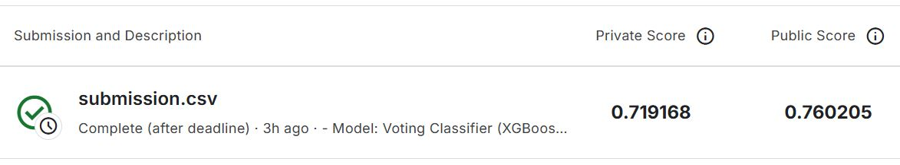

# Fraud Hunter: Fraud Detection Model for IEEE-CIS Fraud Detection

## 프로젝트 개요

**FraudHunter**는 Kaggle의 **IEEE-CIS Fraud Detection competition**을 위한 이상 거래 탐지 모델입니다. 신용 카드 거래 데이터를 분석 및 학습하여 이상 거래 여부를 예측하는 모델을 구축했으며, 불균형 데이터 처리 및 모델 성능 최적화를 중점적으로 다뤘습니다.

## 목차

- [데이터 설명](#데이터-설명)
- [문제 정의](#문제-정의)
- [모델 설계 및 구현](#모델-설계-및-구현)
- [모델 평가](#모델-평가)
- [결과 시각화](#결과-시각화)
- [설치 방법](#설치-방법)
- [사용 방법](#사용-방법)
- [라이센스](#라이센스)

## 데이터 설명

- **출처**: Kaggle (https://www.kaggle.com/competitions/ieee-fraud-detection)
- **데이터셋**:
  - `train_identity.csv`: 훈련 데이터의 아이덴티티 정보
  - `test_identity.csv`: 테스트 데이터의 아이덴티티 정보
  - `train_transaction.csv`: 훈련 데이터의 거래 정보
  - `test_transaction.csv`: 테스트 데이터의 거래 정보
- **목표**: 테스트 데이터에 대한 이상 거래 여부를 예측하는 `submission.csv` 파일을 생성 및 제출하는 것입니다.

## 문제 정의

**IEEE-CIS Fraud Detection competition**의 목표는 주어진 거래 데이터를 기반으로 이상 거래 여부를 예측하는 것입니다. 데이터는 정상 거래와 이상 거래로 구성되어 있으며, 심각한 클래스 불균형이 존재합니다. 또한 데이터의 크기가 매우 크고 수백 개의 특성이 존재하므로 이를 효과적으로 처리하는 것이 중요합니다. 따라서 효율적인 데이터 처리와 모델링 기법을 활용한 모델 학습이 이 프로젝트의 핵심 목표입니다.

## 모델 설계 및 구현

### 1. 모델 정보

- **모델 유형**: Voting Classifier
- **기본 모델**: XGBoost, LightGBM, CatBoost
- **앙상블 방법**: Soft Voting

### 2. 특성 선택

- **방법**: CatBoost 기반의 특성 중요도를 사용하여 선택
- **선택된 특성 개수**: 상위 30개 특성

### 3. 불균형 처리

- **방법**: Synthetic Minority Over-sampling Technique (SMOTE)
- **목적**: 소수 클래스에 대한 합성 샘플을 생성하여 클래스 불균형을 처리

### 4. 임계값 조정

- **방법**: Precision-Recall Curve
- **최적 임계값**: F1-score를 최대화하는 임계값으로 조정

### 5. 데이터 전처리

- **결측값 처리**: 수치형 결측값은 중앙값으로, 범주형 결측값은 최빈값으로 대체
- **데이터 샘플링**: 메모리 부족 문제 및 효율성을 위해 훈련 데이터의 10%만 사용
- **One-Hot Encoding**: 범주형 변수에 대해 원-핫 인코딩을 적용

### 6. 훈련 및 검증

- **훈련 데이터 크기**: 샘플링된 데이터의 80%
- **검증 데이터 크기**: 샘플링된 데이터의 20%
- **교차 검증**: 하이퍼파라미터 튜닝을 위한 3-fold cross-validation

### 7. 예측 결과 저장

- **파일 이름**: submission.csv
- **컬럼**:

  - TransactionID: 각 거래의 고유 ID
  - isFraud: 각 거래의 정상 여부에 대한 예측 결과 (0: 정상 거래, 1: 이상 거래)

## 모델 평가

- **검증 세트 ROC-AUC 점수**: 0.90
- **대회 결과**:

  - Private Leaderboard Score: 0.719168
  - Public Leaderboard Score: 0.760205

  

## 결과 시각화

- Confusion Matrix

  

- ROC Curve

  

- Precision-Recall Curve

  

## 설치 방법

1. 이 저장소를 클론합니다:

   ```sh
   git clone https://github.com/jaeeun225/Fraud_Hunter
   ```

2. 필요한 패키지를 설치합니다:

   ```sh
   pip install pandas numpy matplotlib seaborn scikit-learn catboost xgboost lightgbm imblearn
   ```

3. 데이터를 다운로드하고 data 폴더에 저장합니다:

- 3-1. `download_data.sh` 스크립트 실행:

  `download_data.sh` 스크립트를 실행하여 필요한 데이터를 다운로드합니다.

  ```sh
  bash download_data.sh
  ```

  이 명령어는 Google Drive에서 데이터를 다운로드하고 `data` 폴더에 저장합니다.

- 3-2. Google Drive에서 직접 다운로드:

  만약 스크립트를 실행할 수 없거나 문제가 발생한 경우, 아래 링크에서 파일을 직접 다운로드하여 `data` 폴더에 저장합니다.

  - [train_transaction.csv](https://drive.google.com/file/d/1tD3IZWXZxOGrvTmWRYPbIncRW9dSZ49C/view?usp=sharing)
  - [test_transaction.csv](https://drive.google.com/file/d/1MpMFeGNvODOEx34aMWecaxzhZd8JEp8j/view?usp=sharing)
  - [train_identity.csv](https://drive.google.com/file/d/1M4_kvduTfuhRUxVpDJJnxcRYPrjFVvmO/view?usp=sharing)
  - [test_identity.csv](https://drive.google.com/file/d/1JtfpNoB0u8N80UIcnGPBVyIMdaks_j3D/view?usp=sharing)

## 사용 방법

1. 데이터 전처리 및 모델 학습:

   `fraud_hunter.ipynb` 파일을 실행하여 데이터 전처리 및 모델 학습을 진행합니다.

   ```sh
   jupyter notebook fraud_hunter.ipynb
   ```

   주의: fraud_hunter.ipynb 파일은 데이터 로딩, 전처리, 모델 학습, 예측 결과 생성 및 제출 파일 생성을 포함한 모든 주요 단계를 다룹니다.

2. 예측 결과 저장:

   모델 학습이 완료되면 예측 결과가 `submission.csv` 파일로 저장됩니다.

## 라이센스

이 프로젝트는 MIT License를 따릅니다. 자세한 내용은 [LICENSE](LICENSE) 파일을 참조하세요.
